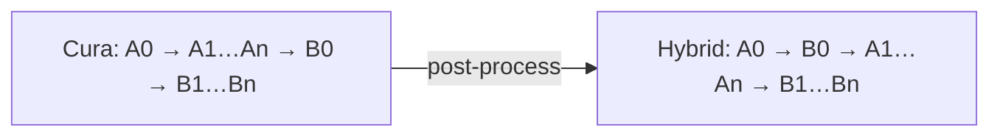

# Cura Hybrid Sequential Print

Experimental, fail-closed post-processing script for **UltiMaker Cura 5.12.0** and an **Ender 3 Pro**. Version 0.3 takes G-code already sliced **One at a Time**, prints layer 0 of every object first, then completes each object sequentially.

## Motivation

This project grew out of repeatedly printing batches of small parts. Printing
all objects layer by layer keeps them progressing together, but it also creates
many travels between parts. Those travels can leave strings, blobs, or marks on
their outer surfaces. If the print is interrupted, none of the objects may be
finished, so the entire batch can be lost.

Printing one object at a time avoids most of those inter-object travels and
finishes usable parts earlier. However, the first layer is also the most
critical: it determines whether each part adheres reliably to the bed. In an
unattended sequential print, the first few objects may finish successfully while
a later object fails to adhere, wasting material and potentially affecting the
rest of the job.

The hybrid strategy aims to take the useful part of both approaches. It prints
the first layer of every object while the operator can verify adhesion across
the whole bed, then completes the objects sequentially. This concentrates the
adhesion-critical period into one limited initial window: the operator can
supervise all first layers without waiting for each object's first layer to
occur throughout a long sequential job. The strategy also reduces travel
between partially printed parts, produces finished objects earlier, and limits
the amount of work exposed to a later interruption. It does not guarantee bed
adhesion or collision safety, but it makes the necessary adhesion supervision
practical and time-bounded. The checks described below remain essential.

> **Warning:** This changes motion order after slicing. Cura cannot re-run its gantry collision model afterward. Preview the exported G-code in an independent viewer and supervise initial tests. A collision can damage the printer or print.

## What it does

- Prints the first layer of every object as one supervised adhesion phase.
- Completes each object sequentially after the common first-layer phase.
- Inserts explicit Z-clearance transitions with absolute XYZ and relative E.
- Avoids only thermal waits proven redundant by the reconstructed heater state.
- Rejects unsupported or ambiguous G-code without partially transforming it.



## Compatibility envelope (v0.3)

- Cura 5.12.0; Ender 3 Pro profile; Marlin-compatible G-code.
- Two to 50 simple, separate objects, each at least two layers tall. The upper
  limit is preventive rather than an algorithmic restriction.
- `Print Sequence = One at a Time` and `Relative Extrusion = enabled`.
- One extruder, no supports, no raft/brim, no overlapping modifiers, no shared prime tower.
- Exactly one common layer (`;LAYER:0`). Negative raft layers are rejected implicitly.
- Cura's own one-at-a-time clearance validation must accept the placement.
- Heated-chamber commands (`M141`/`M191`) in the reordered region are rejected
  by default. The experimental override does not validate their thermal order;
  enable it only after reviewing the exported G-code and planning supervised
  testing.

Anything outside this envelope is unsupported even if the script happens to accept it.

## Install

1. In Cura choose **Help > Show Configuration Folder**.
2. Close Cura. Copy `HybridSequentialPrint.py` into the configuration folder's `scripts` directory (create it if absent).
3. Restart Cura.
4. Slice using the settings above. Open **Extensions > Post Processing > Modify G-Code**, choose **Add a script**, then **Hybrid Sequential Print (experimental)**.
5. Save the G-code and confirm it contains `;HYBRID_SEQUENCE:APPLIED`. If it contains `;HYBRID_SEQUENCE:REJECTED`, it was intentionally left unchanged.

Custom unsigned scripts may be blocked by Cura Enterprise trust policy. This standalone script is not an official UltiMaker extension.

## Release contents

- `HybridSequentialPrint.py`: the single-file Cura post-processing script.
- `examples/BodyBox x4.gcode`: original Cura output for four test objects.
- `examples/BodyBox x4 hybrid.gcode`: transformed output that completed a
  supervised physical test.
- `tests/test_transform.py`: fail-closed acceptance and rejection tests.
- `docs/`: design notes, limitations, test plan, bilingual guide, and bilingual
  roadmap.

## How it works

Cura's post-processing API passes `execute` a list of G-code strings. In a validated one-at-a-time slice, each object is a monotonic run beginning at `;LAYER:0`. The script moves the first chunk of every run ahead of the remaining runs. It inserts an absolute-Z clearance move before resuming each object.
Cura may place an unnumbered transition message immediately before the next object's `;LAYER:0`; the script treats that narrowly validated position as the next object's preamble and moves both together.
Generated transitions emit `G90` followed immediately by `M83`: Marlin clears its relative-extrusion override when `G90` is received, so both commands are required to keep XYZ absolute and E relative.
The script also tracks requested and previously confirmed bed/hotend targets. Inside an inter-object preamble only, a blocking `M190 S...` or `M109 S...` is replaced by an audit comment when its exact target was already confirmed. Changed or unknown targets keep their original wait command.
The script reconstructs the requested hotend target in order and distinguishes a
real `M104` change from a repeated unchanged target such as `220 -> 220`. When
every common layer contains the same single actual transition from first-layer
to normal temperature, it defers that command in all but the final common layer.
The final copy remains at Cura's original position, preserving its thermal lead
time before the first resumed `LAYER:1`. Repeated unchanged targets are retained;
inconsistent or ambiguous actual-transition patterns are rejected.
Heated-chamber commands (`M141`/`M191`) are not yet included in this thermal
model. If they appear in the reordered region, the script rejects the G-code by
default. The **Allow unvalidated heated-chamber commands** setting is an
explicit experimental override: it adds an audit marker and warning, but does
not establish that chamber temperatures remain correct after reordering.

The script refuses to edit when the transformed region contains absolute extrusion (`M82`), relative XYZ (`G91`), XYZ coordinate resets (`G92`), negative/missing/repeated/non-monotonic layer markers, an object count outside two to 50, a common layer that does not establish a complete XYZ end position, a duplicate application, invalid dimensions, or a clearance above machine height. The 50-object ceiling is a preventive resource guard, not an algorithmic restriction. Commands in Cura's untouched ending block—detached or following the final `;TIME_ELAPSED:` marker, where standard Ender 3 G-code commonly uses temporary `G91` and a final `M82`—are permitted. Before resuming an object, the script restores the final XYZ position recorded from that object's common layer; this is required because Cura 5.12 may begin `LAYER:1` with immediate extrusion and no entry travel. It never treats `;MESH:` as an authoritative object boundary: CuraEngine has historically emitted travel/wipe motion on the unexpected side of those comments.

## Two-cube smoke test

See [docs/test-plan.md](docs/test-plan.md). Do not begin with valuable hardware or an unattended print.

## Physical validation

Supervised tests on the documented Ender 3 Pro/Cura 5.12.0 workflow have
successfully completed both a small two-object print and a 16-object
`BodyBox x16 hybrid.gcode` print. The 16-object run completed the shared first
layer and all objects sequentially with the expected extrusion and thermal
behavior. These results validate the tested files and configuration only; they
do not prove collision safety for other layouts, models, profiles, or printers.

## Development

The transformation core is intentionally kept in the Cura script so installation remains a one-file copy. Tests stub Cura's imports:

```text
python -m unittest discover -s tests -v
```

For a step-by-step explanation of the algorithm, reordering diagrams, and
comparisons with Java, Groovy, C#, and VBA, see the code guide in
[English](docs/code-guide.md) or [Spanish](docs/guia-del-codigo.md).

Proposed improvements and unimplemented ideas are maintained in the roadmap in
[English](docs/roadmap.en.md) and [Spanish](docs/roadmap.md).

## Status

This is an experimental **v0.3.0 release**, not a claim of production safety. See [docs/design.md](docs/design.md), [docs/limitations.md](docs/limitations.md), and [CONTRIBUTING.md](CONTRIBUTING.md).

## Author

Created and maintained by **EdoFro**.

## License

MIT. The project uses Cura's documented runtime interface but copies no Cura implementation. Cura's Post Processing plugin itself is LGPL-3.0-or-later; users must comply with Cura's license for Cura itself.
