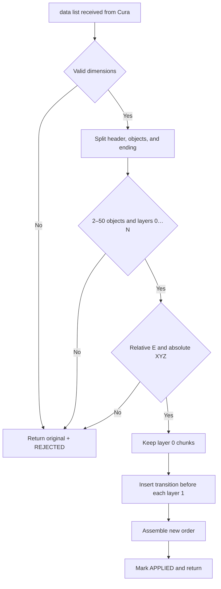
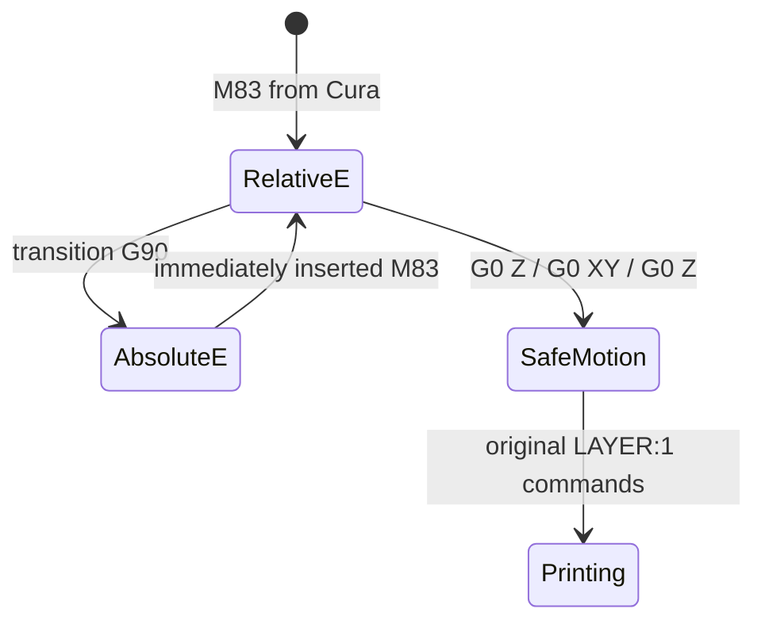

# Code guide for developers unfamiliar with Python

> Language: English. [Read this guide in Spanish](guia-del-codigo.md).

This guide explains `HybridSequentialPrint.py` for readers familiar with
Groovy, VBA, Java, VB, or C#. The script has two separate responsibilities:

1. understand and validate the list of G-code chunks supplied by Cura;
2. reorder those chunks without reinterpreting the printing paths.

The most important separation is between `transform`, which contains the pure
logic, and `HybridSequentialPrint.execute`, which acts as the Cura adapter.

## Mental model

Cura supplies a list of strings, not one string and not necessarily exactly one
item per layer. A simplified representation is:

```text
data = [header, A0, A1, A2, B_prelude, B0, B1, B2, ending]
```

B's prelude may contain retraction, motion, heating, and `;LAYER_COUNT`.
`_split_object_runs` associates it with B0 before reordering:

```text
prefix = [header]
runs   = [[A0, A1, A2], [B_prelude + B0, B1, B2]]
suffix = [ending]
```

The intended output is:


The script moves complete chunks. It does not recalculate walls, infill,
speeds, or extrusion amounts.

## Main flow



Validation happens before assembly. This is the *fail-closed* principle: when
the format is not unambiguous, the script does not attempt a partial result.

## Marlin modal state

G-code commands modify state that remains active until another command changes
it. This resembles changing properties on a global interpreter object.



`G90` ensures absolute XYZ coordinates, but in Marlin it also returns E to
absolute mode. Each transition must therefore emit `M83` immediately afterward.
A physical test confirmed this detail: without the second command, the printer
stopped delivering material when it resumed the objects.

## How a transition is calculated

The final XYZ position of each object's layer 0 is retained. Suppose:

```text
final position of A0 = X99.425 Y61.451 Z0.440
safe height          = 14.000
```

The following is inserted before A1:

```gcode
G90 ; absolute XYZ
M83 ; relative E
G0 Z14.000
G0 X99.425 Y61.451
G0 Z0.440
```

The rise occurs before XY travel, so the nozzle does not cross laterally at low
height. The script then restores the exact XYZ state from which Cura expected
A1 to continue.

## Functions and responsibilities

| Function | Conceptual equivalent | Responsibility |
|---|---|---|
| `_layer_number` | Small parser | Gets one `;LAYER:n` marker |
| `_split_object_runs` | Grouping/partitioning | Builds header, objects, and ending |
| `_max_z` | `max` aggregation | Finds the greatest explicit Z |
| `_end_point` | State reconstruction | Gets the final XYZ of a layer 0 |
| `_insert_transition` | Text generator | Inserts `G90`, `M83`, and three travels |
| `transform` | Pure/static method | Validates, reorders, and returns a new list |
| `execute` | Framework adapter | Reads the Cura profile and handles errors |

## Quick comparisons with other languages

| Python | Java/Groovy/C# or VBA |
|---|---|
| `None` | `null` / `Nothing` |
| `List[str]` | `List<String>` |
| `Dict[str, float]` | `Map<String, Double>` / `Dictionary` |
| `for item in items` | `for (item : items)` / `For Each` |
| `[f(x) for x in xs]` | `xs.collect { f(it) }` / LINQ `Select` |
| `raise ValidationError(...)` | `throw new ValidationException(...)` |
| `try / except` | `try / catch` |
| `Tuple[X, Y]` | Record/tuple containing several values |
| `Sequence[str]` | Conceptual read-only collection interface |

Names beginning with `_` mean “internal use” by convention; Python does not
make them strictly private.

## Why `transform` does not modify files

`transform(data, clearance, machine_height)` receives values and returns values.
It knows nothing about windows, paths, or Cura profiles. Tests can therefore
create small G-code lists and compare the result directly.

`execute`, on the other hand:

1. reads the active profile;
2. validates Ender 3 Pro, One at a Time, supports, and adhesion;
3. calls `transform`;
4. if a `ValidationError` occurs, displays a message and returns the original.

## Following a unit test

Start with `test_reorders` in `tests/test_transform.py`:

1. `chunks()` creates two synthetic objects with layers 0, 1, and 2;
2. `transform(...)` produces the output;
3. the test extracts the layer numbers;
4. it checks `[0, 0, 1, 2, 1, 2]`;
5. it checks two transitions and the `G90`/`M83` pair.

Next, read the tests whose names begin with `test_rejects_`. Each documents a
format that deliberately falls outside the contract.

## Remaining limits

- A safe nozzle Z does not prove clearance for the entire carriage.
- Thermal waits are omitted only when the requested target and last confirmed
  target match exactly. Changes or unrecognized forms preserve the original
  `M190`/`M109`.
- Estimated times and `TIME_ELAPSED` comments are not recalculated.
- Only the documented Cura 5.12.0, Ender 3 Pro, and Marlin envelope is accepted.

The first physical test with two 12 × 12 × 4 mm objects completed the hybrid
sequence successfully after restoring `M83` in transitions. A later
`BodyBox x16 hybrid.gcode` test also completed the first layers of all 16
objects and their sequential completion successfully, with the expected thermal
and extrusion behavior. These results apply only to the tested files and
configuration.

## How redundant thermal waits are avoided

The script maintains two states for each heater:

- `requested`: the last target set by `M104`/`M140`;
- `confirmed`: the last target reached through `M109`/`M190`.

If the next object's prelude waits for a value that exactly matches both, the
blocking command is replaced by a comment such as
`;HYBRID_SEQUENCE:SKIPPED_REDUNDANT_M109 S230`. Without enough evidence, the
command is preserved. This reduces the time a hot nozzle remains stationary
over the next object's area.

There is an earlier step for first-layer temperature. Cura may insert
`M104 S225` near the end of every `LAYER:0` to begin cooling from 230 °C before
`LAYER:1`. Because hybrid order prints every layer 0 first, the script replaces
that command with `DEFERRED_COMMON_M104` in A0, B0, and so forth, retaining only
the command in the final common layer. All first layers therefore print at
230 °C, and anticipated cooling begins at the end of the common phase, just
before A1 resumes.

```text
A0 @230 ─ B0 @230 ─ C0 @230 ─ D0 @230→225 ─ A1 @225 ─ ...
```

To decide this, the script reconstructs the requested target through the header,
preludes, and common layers. A repetition that does not change the target, such
as `220 -> 220`, is not a transition and is retained without deferral. The
optimization applies only when every object contains exactly one actual `M104`
change with the same target. An incomplete, multiple, or inconsistent pattern of
actual changes is rejected rather than interpreted ambiguously.
