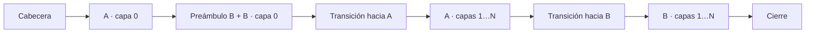
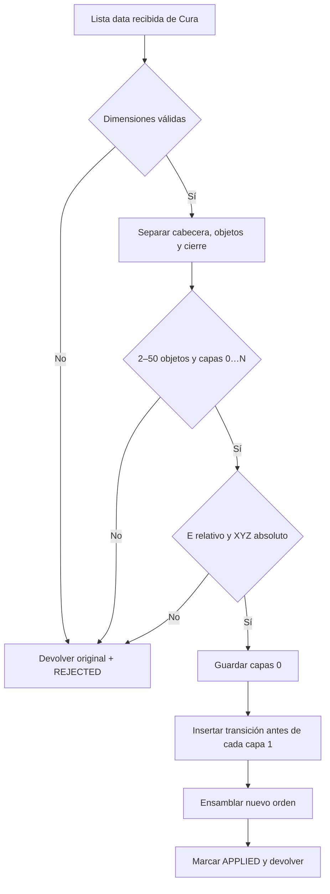
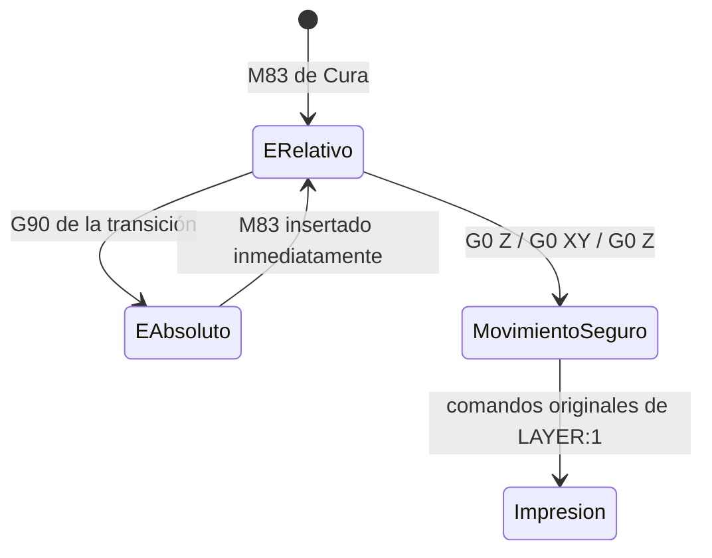

# Guía del código para programadores no familiarizados con Python

> Idioma: español. [Read this guide in English](code-guide.md).

Esta guía explica `HybridSequentialPrint.py` pensando en alguien que conoce
Groovy, VBA, Java, VB o C#. El script tiene dos responsabilidades separadas:

1. entender y validar la lista de bloques G-code entregada por Cura;
2. reordenar esos bloques sin reinterpretar las trayectorias de impresión.

La separación más importante es entre `transform`, que contiene la lógica pura,
y `HybridSequentialPrint.execute`, que actúa como adaptador de Cura.

## Modelo mental

Cura entrega una lista de cadenas, no una única cadena ni necesariamente un
elemento exacto por capa. Una representación simplificada es:

```text
data = [cabecera, A0, A1, A2, preámbulo_de_B, B0, B1, B2, cierre]
```

El preámbulo de B puede contener retracción, movimiento, calentamiento y
`;LAYER_COUNT`. `_split_object_runs` lo asocia a B0 antes de reordenar:

```text
prefix = [cabecera]
runs   = [[A0, A1, A2], [preámbulo_de_B + B0, B1, B2]]
suffix = [cierre]
```

La salida buscada es:



El script mueve bloques completos. No recalcula paredes, relleno, velocidades
ni cantidades de extrusión.

## Flujo principal



Las validaciones ocurren antes del ensamblaje. Esta es la idea de *fail-closed*:
si el formato no es inequívoco, no se intenta producir un resultado parcial.

## Estado modal de Marlin

Los comandos G-code cambian un estado que continúa vigente hasta recibir otro
comando. Es parecido a modificar propiedades de un objeto global del intérprete.



`G90` garantiza coordenadas XYZ absolutas, pero en Marlin también vuelve E al
modo absoluto. Por eso cada transición debe emitir `M83` inmediatamente después.
Este detalle fue confirmado mediante una prueba física: sin el segundo comando,
la impresora dejó de entregar material al reanudar los objetos.

## Cómo se calcula una transición

Para cada objeto se conserva la última posición XYZ de su capa 0. Supongamos:

```text
posición final de A0 = X99.425 Y61.451 Z0.440
altura segura        = 14.000
```

Antes de A1 se inserta:

```gcode
G90 ; XYZ absoluto
M83 ; E relativo
G0 Z14.000
G0 X99.425 Y61.451
G0 Z0.440
```

La subida ocurre antes del movimiento XY. Así la boquilla no cruza lateralmente
a baja altura. Luego se restaura exactamente el estado XYZ desde el cual Cura
esperaba continuar A1.

## Funciones y responsabilidades

| Función | Equivalente conceptual | Responsabilidad |
|---|---|---|
| `_layer_number` | Parser pequeño | Obtiene un único `;LAYER:n` |
| `_split_object_runs` | Agrupación/particionado | Construye cabecera, objetos y cierre |
| `_max_z` | Agregación `max` | Encuentra el mayor Z explícito |
| `_end_point` | Reconstrucción de estado | Obtiene el XYZ final de una capa 0 |
| `_insert_transition` | Generador de texto | Inserta `G90`, `M83` y tres viajes |
| `transform` | Método puro/static | Valida, reordena y devuelve una lista nueva |
| `execute` | Adaptador de framework | Lee el perfil de Cura y gestiona errores |

## Correspondencias rápidas con otros lenguajes

| Python | Java/Groovy/C# o VBA |
|---|---|
| `None` | `null` / `Nothing` |
| `List[str]` | `List<String>` |
| `Dict[str, float]` | `Map<String, Double>` / `Dictionary` |
| `for item in items` | `for (item : items)` / `For Each` |
| `[f(x) for x in xs]` | `xs.collect { f(it) }` / LINQ `Select` |
| `raise ValidationError(...)` | `throw new ValidationException(...)` |
| `try / except` | `try / catch` |
| `Tuple[X, Y]` | record/tuple con varios valores |
| `Sequence[str]` | interfaz de colección de solo lectura conceptual |

Los nombres que comienzan con `_` indican “uso interno” por convención; Python
no los vuelve privados de manera estricta.

## Por qué `transform` no modifica archivos

`transform(data, clearance, machine_height)` recibe valores y devuelve valores.
No conoce ventanas, rutas ni perfiles de Cura. Esto permite que las pruebas creen
listas G-code pequeñas y comparen el resultado directamente.

`execute`, en cambio:

1. consulta el perfil activo;
2. valida Ender 3 Pro, One at a Time, soportes y adhesión;
3. llama a `transform`;
4. si ocurre `ValidationError`, muestra un mensaje y devuelve el original.

## Cómo seguir una prueba unitaria

Empieza por `test_reorders` en `tests/test_transform.py`:

1. `chunks()` crea dos objetos sintéticos con capas 0, 1 y 2;
2. `transform(...)` produce la salida;
3. la prueba extrae los números de capa;
4. comprueba `[0, 0, 1, 2, 1, 2]`;
5. comprueba dos transiciones y la pareja `G90`/`M83`.

Después conviene leer las pruebas cuyo nombre comienza por `test_rejects_`.
Cada una documenta un formato que deliberadamente queda fuera del contrato.

## Límites que permanecen

- La altura segura de la boquilla no demuestra la holgura de todo el carro.
- Las esperas térmicas se omiten únicamente cuando el objetivo solicitado y el
  último objetivo confirmado coinciden exactamente. Cambios o formatos no
  reconocidos conservan el `M190`/`M109` original.
- Los tiempos estimados y comentarios `TIME_ELAPSED` no se recalculan.
- Solo se admite la envolvente documentada de Cura 5.12.0, Ender 3 Pro y Marlin.

La primera prueba física de dos piezas de 12 × 12 × 4 mm completó correctamente
la secuencia híbrida después de restaurar `M83` en las transiciones. Una prueba
posterior con `BodyBox x16 hybrid.gcode` también completó satisfactoriamente las
primeras capas de los 16 objetos y su terminación secuencial, con el
comportamiento térmico y de extrusión esperado. Estos resultados corresponden
únicamente a los archivos y configuración probados.

## Cómo se evitan esperas térmicas redundantes

El script mantiene dos estados por calefactor:

- `requested`: último objetivo fijado por `M104`/`M140`;
- `confirmed`: último objetivo alcanzado mediante `M109`/`M190`.

Si el preámbulo del objeto siguiente pide esperar exactamente por un valor que
coincide con ambos, el comando bloqueante se reemplaza por un comentario, por
ejemplo `;HYBRID_SEQUENCE:SKIPPED_REDUNDANT_M109 S230`. Si no hay evidencia
suficiente, el comando se conserva. Esta optimización reduce el tiempo que la
boquilla caliente permanece detenida sobre la zona de la pieza siguiente.

Hay un paso anterior para la temperatura de primera capa. Cura puede insertar
`M104 S225` cerca del final de cada `LAYER:0` para comenzar a bajar desde 230 °C
antes de `LAYER:1`. Como el orden híbrido imprime primero todas las capas 0, el
script reemplaza ese comando por `DEFERRED_COMMON_M104` en A0, B0, etc., y
conserva únicamente el de la última capa común. De este modo todas las primeras
capas se imprimen a 230 °C y el enfriamiento anticipado comienza al final de la
fase común, justo antes de reanudar A1.

```text
A0 @230 ─ B0 @230 ─ C0 @230 ─ D0 @230→225 ─ A1 @225 ─ ...
```

Para decidirlo, el script reconstruye el objetivo solicitado desde la cabecera,
los preámbulos y las capas comunes. Una repetición que no cambia el objetivo,
como `220 → 220`, no se considera una transición y se conserva sin aplazar. La
optimización solo se aplica cuando cada objeto presenta exactamente un cambio
real `M104` con el mismo objetivo. Un patrón de cambios reales incompleto,
múltiple o inconsistente se rechaza para evitar interpretar intenciones térmicas
ambiguas.
